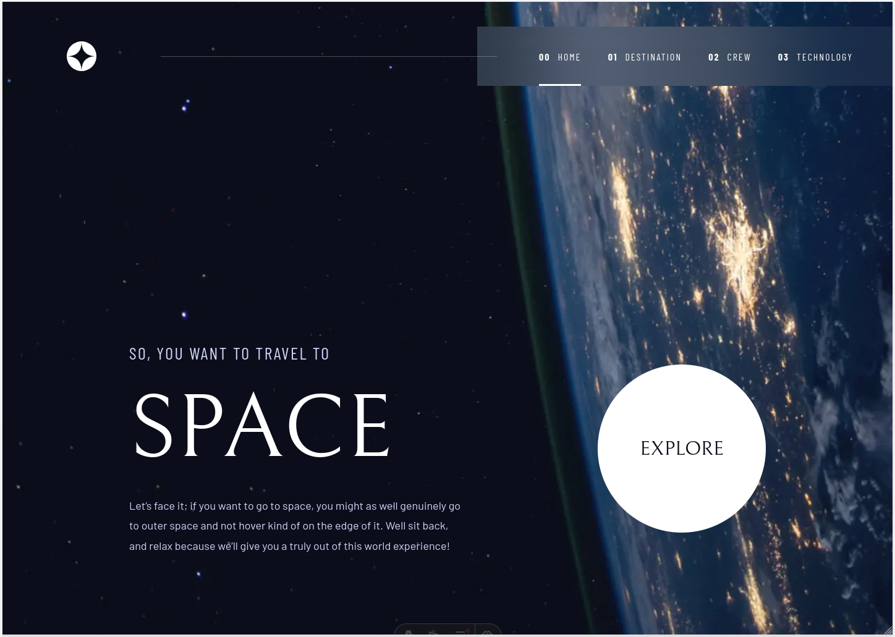
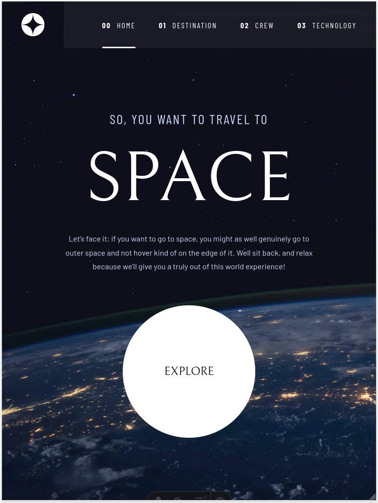
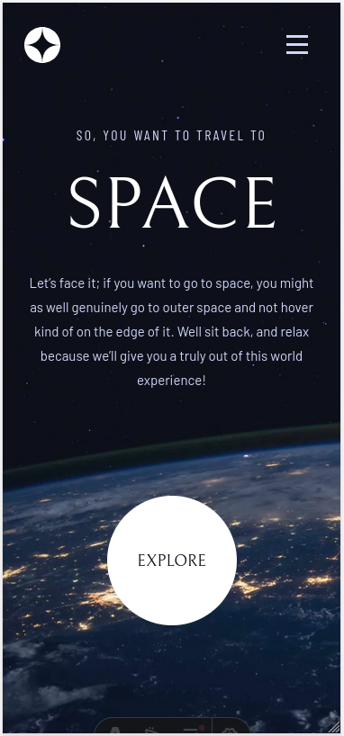

# Frontend Mentor - Space tourism website solution

This is a solution to the [Space tourism website challenge on Frontend Mentor](https://www.frontendmentor.io/challenges/space-tourism-multipage-website-gRWj1URZ3). Frontend Mentor challenges help you improve your coding skills by building realistic projects.

## Table of contents

- [Overview](#overview)
  - [The challenge](#the-challenge)
  - [Screenshot](#screenshot)
  - [Links](#links)
- [My process](#my-process)
  - [Built with](#built-with)
  - [What I learned](#what-i-learned)
  - [Continued development](#continued-development)
  - [Useful resources](#useful-resources)
  - [AI Collaboration](#ai-collaboration)
- [Author](#author)

## Overview

### The challenge

BOSSladiss should be able to:

- View the optimal layout for each of the website's pages depending on their device's screen size
- See hover states for all interactive elements on the page
- View each page and be able to toggle between the tabs to see new information

### Screenshot





### Links

- Solution URL: [Solution URL here](https://github.com/BOSSladis/space-tourism-website)
- Live Site URL: [Live site URL here](https://bossladis.github.io/space-tourism-website/)

## My process

### Built with

- [Astro](https://astro.build/) - static site generator, used to keep the project free of a client-side JS framework bundle while still allowing component-based architecture
- Semantic HTML5 markup
- CSS custom properties
- Fluid typography and spacing with `clamp()`
- Mobile-first responsive design
- BEM (Block Element Modifier) methodology
- TypeScript for interactive scripts
- Astro View Transitions for page-to-page animations
- Flexbox

### What I learned

This project was a good opportunity to bring together a lot of things I already knew but hadn't necessarily put into practice all at once, while turning a single design into a working site.

**Fluid typography and spacing.** Rather than jumping values at fixed breakpoints, I used `clamp()` to interpolate `font-size`, `padding`, and other values smoothly between breakpoints, only falling back to fixed values or media queries where the design genuinely called for a plateau or a discrete jump. I used [Utopia's clamp calculator](https://utopia.fyi/clamp/calculator/) to generate most values.

```css
/*
  slope = ((max-min) / (sizeWhenMax - sizeWhenMin))
  slope = ((9rem-5rem) / (48rem - 30rem))
  slope = 0.2222

  origin = (min - (sizeWhenMin x slope))
  origin = (5rem - (30rem x 0.2222))
  origin = -1.667rem

  min | origin + slope | max
*/
font-size: clamp(5rem, -1.6667rem + 22.2222vw, 9rem);
```

**Accessible disclosure/dialog patterns.** Implementing the mobile navigation menu as a proper modal dialog (`role="dialog"`, `aria-modal`, focus trapping via the native `inert` attribute, returning focus to the trigger on close, and closing on `Escape` or outside click) taught me the difference between a simple disclosure widget and a true modal, and why that distinction matters for screen reader and keyboard users.

**Astro's style scoping.** Astro scopes component styles automatically by injecting a `data-astro-cid-*` attribute, which affects CSS specificity in non-obvious ways once styles are shared across components (e.g. a reusable `NavLink` component styled from its parent). Working through several specificity conflicts taught me when to reach for `:global()`, when to raise specificity deliberately by chaining selectors, and when a CSS custom property is a cleaner contract between a parent layout and a child page than fighting the cascade.

**Flexbox edge cases.** Ran into the implicit `min-height: auto` on flex items preventing a 50/50 split between two columns, and a real cross-browser inconsistency between `flex-basis: 0` and `flex-basis: 0%` — a good reminder to verify unexpected layout behaviour in the browser rather than assume the shorthand is always equivalent to writing it out longhand.

**Pointer Events over separate Mouse/Touch listeners.** Used `pointerdown`/`pointerup` to implement swipe navigation between crew members and technology items, which unified mouse and touch handling under a single API instead of duplicating logic.

**View Transitions and script lifecycle.** Learned to wrap scripts in `astro:page-load` and clean up listeners on `astro:before-preparation` so client-side behaviour keeps working correctly across Astro's client-side navigation, rather than only on a full page load.

### Continued development

- Pay even closer attention to small details when comparing the implementation against the design, rather than considering something "close enough"
- Keep learning and reaching for the tool best suited to a given problem — whether that's a specific HTML element, a CSS feature, or a JS API — rather than defaulting to a familiar one out of habit

### Useful resources

- [Utopia.fyi Clamp Calculator](https://utopia.fyi/clamp/calculator/) - used to double-check hand-calculated fluid `clamp()` values
- [WAI-ARIA Authoring Practices - Dialog (Modal) Pattern](https://www.w3.org/WAI/ARIA/apg/patterns/dialog-modal/) - reference for the mobile navigation implementation
- [MDN - `inert`](https://developer.mozilla.org/en-US/docs/Web/HTML/Global_attributes/inert) - native way to remove background content from the accessibility tree while a modal is open
- [Josh Comeau's Custom CSS Reset](https://www.joshwcomeau.com/css/custom-css-reset/) - reset used as the project's base

### AI Collaboration

Used Claude or Gemini for debugging code, formatting the README and structuring commit messages.

## Author

- Frontend Mentor - [@BOSSladis](https://www.frontendmentor.io/profile/BOSSladis)
